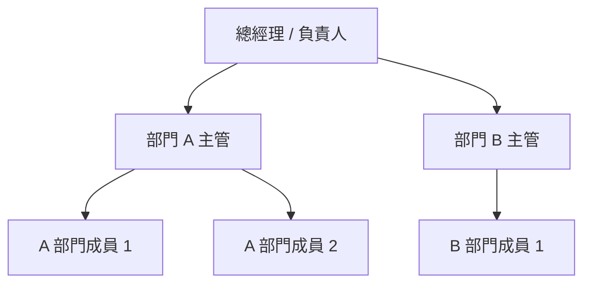

# 人員名單與組織架構整理

## 存取來源狀態
目前執行環境無法連線至 Google Docs（`docs.google.com`），因此無法直接擷取你提供文件內容進行實際整理。

- 連線測試：`curl -L 'https://docs.google.com/document/d/e/2PACX-1vQhFn9o2px1caT9SbTeE-ATl89Th6_hFKRvK-q8Wv2GL9xY13MUdZsT4gJ4fL2WD7vYMT17uJamIc6f/pub'`
- 錯誤：`CONNECT tunnel failed, response 403` / `Couldn't connect to server`

## 可直接套用的整理格式

### 1) 人員名單（建議欄位）

| 部門 | 職稱 | 姓名 | 匯報對象 | 備註 |
|---|---|---|---|---|
| 範例：營運部 | 部門主管 | 王小明 | 總經理 | - |
| 範例：營運部 | 專員 | 李小華 | 王小明 | - |

### 2) 組織架構圖（Mermaid）

## 後續
只要提供文件文字內容（可貼上原文或提供可在此環境直接存取的連結），我可以立即回填成完整的人員名單與正式組織架構圖。
